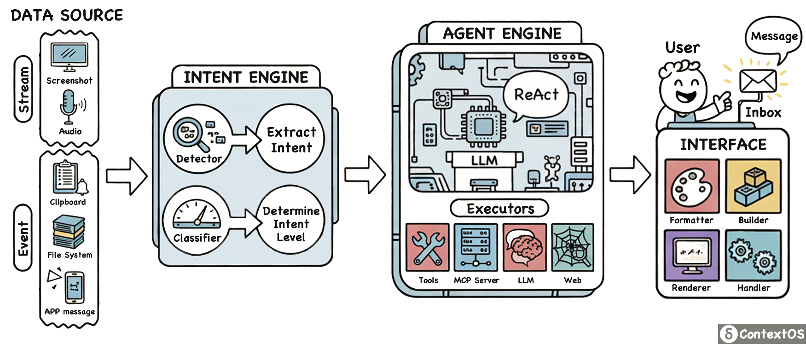

# ContextOS

**中文 | [English](README.md)**

[亮点](#亮点) | [快速开始](#快速开始) | [架构](#架构) | [参与贡献](#参与贡献) | [🌐 官网](https://xfey.github.io/ContextOS/)

首个以 AI 感知为中心的主动式 Agent 框架，让 AI 从「等待指令」进化为「主动服务」。

The first **AI-Centric** Proactive Agent Framework

试用基于 ContextOS 开发的 demo 产品：Zero-step Clipboard

- 下载 `.dmg` 文件：[Releases](https://github.com/xfey/ContextOS/releases)
- 如何使用：[查看安装说明](#安装说明)

## 亮点

一种以 AI 为中心的 Agent：一切行为都是提供给 AI 的上下文，由 AI 成为智能体的中心，而非固定于人类预定义的工作流。通过给 AI 极致的自主性和尽可能丰富的上下文，以打造一个不同于传统模式的智能体。

这样的 Agent 会持续采集信号、理解用户意图，以在合适的时候主动给予用户对应的帮助。例如，当用户复制了一大段外语内容，ContextOS 会猜测用户需要翻译，并主动通知用户翻译的结果。比起传统 Agent 需要用户主动问询大模型，ContextOS 让智能体的介入更近一步。

因此，希望 ContextOS 能够提供一个清晰可拓展的框架，给大模型更多的上下文、更自由的输入输出，以实现更智能的 Agentic AI。并在此之上，首先打造了一个简单的 demo，实现了「智能剪贴板」的功能：支持文本、图像及混合输入，让 AI 基于内容提供帮助。

## 快速开始

### 系统要求

- **操作系统**：macOS 12.0 或更高版本
- **API Key**：支持 OpenAI 兼容接口的大模型 API Key
- **模型要求**：
  - 支持图像输入：需使用视觉模型（如 `gpt-4o`、`qwen3-vl-flash`）
  - 仅文本任务：可使用普通模型（如 `gpt-5-mini`、`qwen-plus`）

#### 安装说明

1. 打开下载的 `.dmg` 文件，将 ContextOS App 拖拽到「应用程序」文件夹内
2. 稍等片刻，在启动台内，就会有 ContextOS 图标以供使用
3. 如果弹出相关权限申请，请在系统设置中开启
   > ContextOS 需要剪贴板等权限以作为上下文输入
4. 如果首次启动显示「阻止了应用程序启动」，请在系统设置-隐私与安全中点击允许
5. 首次使用前，请设置一个有效的大模型 API key，并且切换您的默认语言

### 配置 LLM API

ContextOS 使用 OpenAI 接口格式进行调用，`Provider` 一项请使用默认的 `OpenAI` 不要更改。然后配置以下项目：

- `Base URL`: API 接口地址，一般以 `https` 开头
- `Model`: 模型名称，例如 `gpt-4o` 或 `qwen3-vl-flash`
- `API Key`: 你的 API Key 字符串

#### 模型选择建议

- **中国用户推荐**：`qwen3-vl-flash`（通义千问提供免费额度，同时访问的响应较快）
- **其他选择**：可尝试 [OpenRouter](https://openrouter.ai/) 提供的各类模型

**提示**：推荐选择「更快」而非「更大」的模型，更低的时延会带来明显更好的使用体验。

设置完毕后，系统会自动检查 API Key 有效性。如果网络卡顿导致失败，请多试几次。

## 架构

ContextOS 包含四个主要模块：
- 数据源(Data Source): 从不同的来源采集原始数据。数据源包含**事件**和**流**两种类型，事件指离散的信号（如剪贴板的某次更新），流指持续采集的数据（如屏幕画面）；
- 意图引擎(Intent Engine): 基于数据的一些特征，检测是否存在用户意图，并进行意图分类；
- 智能体引擎(Agent Engine): 采用 ReAct 架构，通过"思考-行动-观察"的迭代循环执行任务。AI 根据用户意图进行推理、调用工具、观察结果，直到完成任务目标；
- 界面(Interface): 渲染用户界面，并管理会话状态。用户通过收件箱(Inbox)接收 ContextOS 的通知，并进行交互。根据任务复杂度，系统提供 Notify（通知模式，自动完成）和 Review（对话模式，多轮交互）两种交互方式。

#### 设计特点

ContextOS 的目标是成为一个清晰可拓展的架构。因此，重点突出了以下设计：
- 清晰的数据流：由adapter采集数据，然后经过engine进行意图识别、任务执行，最终由interface负责交互
- 简单易继承：adapter 数据接口、integrations 工具拓展接口简单，只需实现核心功能便可轻松拓展
- 统一管理的 prompt：所有的 prompt 文件统一放置在特定文件夹内，便于用户更迭管理
- 可拓展的支持性：工具和数据源配置文件简单清晰，易于拓展和支持

希望开发者们基于 ContextOS 可以设计更多的内容，推动「AI-centric」智能体的发展。ContextOS 的开发有一些简单的实践：

**如何拓展输入数据源**：除了目前已经激活的剪贴板，项目其实已经在代码[./adapters/stream/screenshot.py]中完成了屏幕截图的支持。可以轻松拓展到更多的来源，只需实现关键的某几个函数即可。

**如何增加工具**：为了降低 API keys 管理的复杂度，项目内目前只实现了几项基本工具。在 `integrations/` 内可以看到，工具的实现也只需要实现基本的 schema 和 `execute` 等方法即可，非常容易实现。

**是否需要用户界面**：直观的交互界面可以很快地突出 ContextOS 的特点。如果只是将 ContextOS 的核心流程作为后端实现，那么完全可以摈弃复杂的 `interfaces` 用户界面部分，只保留核心数据流程即可。

#### 存在的缺点

ContextOS 并不是一个完善的工作，在设计过程中，也遇到了如下的一些问题：

**UI复杂度**：核心的数据结构定义实际上只用了很短的时间，但更多的精力和代码量均用于开发用户界面。作为一个简单的 demo，目标是给予用户更好的体验，同时推广「AI-centric」的智能体设计理念。

**未完成的部分**：目前尚未添加更多的工具、更多的数据输入源，并且也还没有支持 MCP server 与记忆体。

## 参与贡献

请热情地参与到本项目中来，一起构建「AI-centric」智能体！
- 如果基于 ContextOS 拓展了更多功能，或者设计了更有效的 prompt
- 如果发现了一些 bug 并进行修改
- 如果为 ContextOS 的拓展性和其他方面提供了支持

或者，如果您或您的组织愿意提供免费的 API key 以供更多用户体验 ContextOS 及相关衍生产品，也将十分感谢！

欢迎任何形式的友好交流！
Email: xfey99@gmail.com
